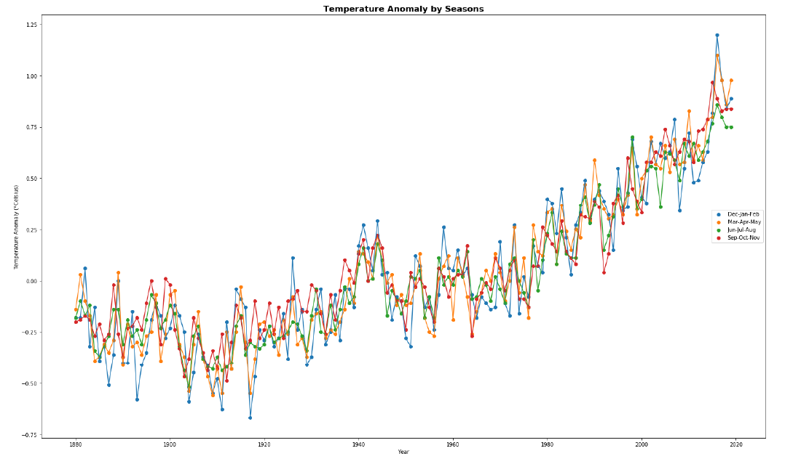
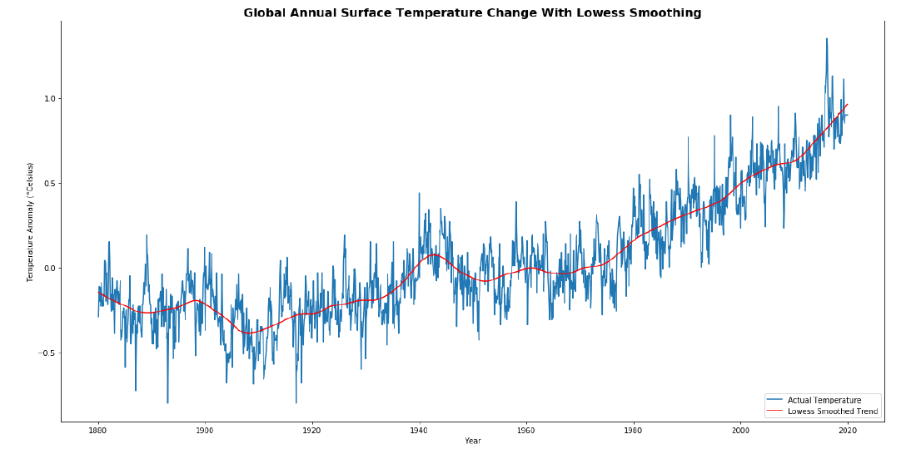
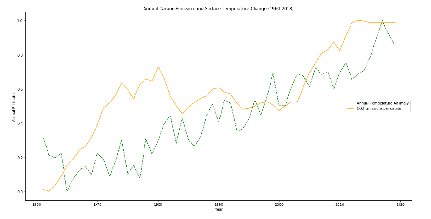
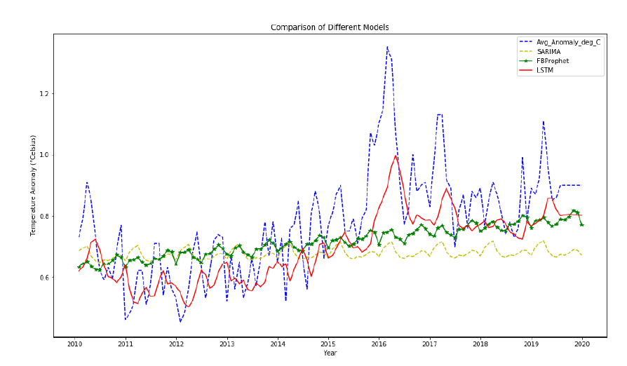

# Climate Change - A compulsory subject in the syllabus?
Climate change has been a major concern in recent times due to the detrimental effects of industrial revolution and even more from the technological boom since late 1990s. Today, we not only hear about the many extremities of climate change around the world but also the natural disasters. One major effect as well as a reason is the Global Warming. Many organizations, associations, even people in art and science are working together to spread awareness and working to take concisous efforts and steps to not only curb this rise in temperature and melting glacier belts but also build a sustainable future for not just our successors but also heed to a better economic and social growth worldwide. From our initial research, we Carbon emissions have been known to be the major concern of pollution and raising temperatures. In our project, we compare and analyze the correlation between these two phenomena using Granger causality test along with forecasting how the trend of raising temperatures are going to be if the current situation continues using data-driven time series forecasting models.

### Data

We have built analysis and forecasts on two datasets.
1. The GISS Surface Temperature estimates from NASA: This dataset provides the estimates of global surface temperature change for both land and sea. These temperature estimates are
sourced and calculated from the recordings of the GBL SST - Global Metop Sea Surface Temperature. The dataset is available monthly and the date range for this project is Jan-1880 to Jul-2019. These temperature changes are more technically called anomalies. When it comes to analyzing climate change or raising temperatures, it is more suitable to utilize the anomalies than the actual recordings and therefore the choice to go ahead with these estimates rather than the actual temperature recordings. The temperature estimates are in Degree Celcius metrics.

2. Carbon Dioxide Emission estimates from WorldBank: This data is sourced from the U.S. Department of Energy's Carbon Dioxide Information Analysis Center. Carbon dioxide as a gas occurs naturally as well. It is among the gases that keeps the Earth's radiative balance. But it also has anthropogenic origins majorly through fossil-fuel combustion, biomass burning and a variety of industrial processes. This has lead to Carbon dioxide having the largest share among the greenhouse gases in terms of emissions that are the main cause of global warming. The data used here are estimates of Carbon emissions from the largest anthropogenic emissionsof fossil fuel combustion and world cement manufacturing. For our project we use the annual recordings for each country from 1960-2018. The emissions values provided are per capita for uniformity in a worldwide dataset and measured in metric tonnes.

The data is present in the data folder.

### Install

This project requires **Python 3** and the following Python libraries installed:

- [pmdarima for autoarima](https://pypi.org/project/pmdarima/)
- [fbprophet](https://pypi.org/project/fbprophet/)
- [keras for LSTM](https://keras.io/)
- [adfuller test to test the stationarity of time series](https://www.statsmodels.org/dev/generated/statsmodels.tsa.stattools.adfuller.html)
- [granger causality to test the correlation between time series](https://www.statsmodels.org/dev/generated/statsmodels.tsa.stattools.grangercausalitytests.html)

Make sure you have [Jupyter Notebook](http://ipython.org/notebook.html) installed.

You could just install [Anaconda](http://continuum.io/downloads) distribution of Python, which already has the above packages and more included. 

### Run

In a terminal or command window, navigate to the top-level project directory (that contains this README) and run one of the following commands and also make sure sunroofanalysis_function.py is in the same directory as the climate_change.ipynb. I am importing some user defined functions from the python file :

```bash
ipython notebook climate_change.ipynb
```  
or
```bash
jupyter notebook climate_change.ipynb
```

This will open the Jupyter Notebook software and project file in your browser.

### Results

Seasonal Temprature anomalies:
We have plotted the seasonal anomaly estimates provided in the dataset as DJF,MAM,JJA and SON depicting, winter,spring, summer and fall. From the multi-series line plot, it is clear that there has been an less or not much anomaly until 1960 but after 1960 the changes have a steep slope and rapid too. For example, the lower temperature changes for winter between 2000-2020 are in much higher temperatures than they for the highest anomalies between 1940-1960.



Global Surface Temperature Anomaly Trend:
For the plot, we leverage the statsmodels package for lowess smoothing. This helps in observing the general overall trend of the data over a fraction along the timeline. It is very similar to a moving average and the smoothing window chosen here is 1/10th or the smoothing performed over a window of 10 years.



Trend of Carbon Emission:


Temprature and Carbon Emission Correlation Trend:



Comparison of Season Auto Arima, FBprophet and LSTM for forecasting:
Here against the Actual value plot in blue, we see that LSTM's predictions in red are a better
estimation than the other models.



### Contributing
Pull requests are welcome. For major changes, please open an issue first to discuss what you would like to change.

Please make sure to update tests as appropriate.


